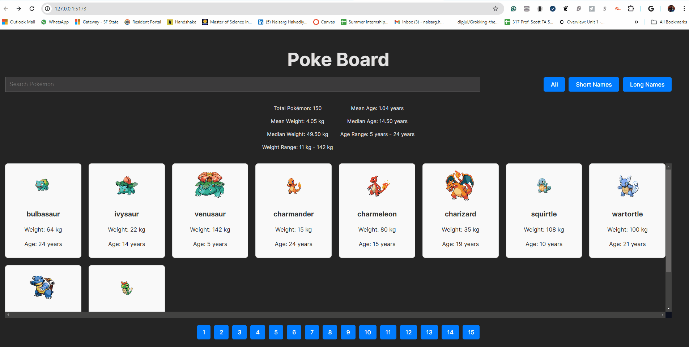

# Web Development Project 5 - *Name of App Here*

Submitted by: **Poke Board**

This web app: **Poke Board- showcasing API usage**

Time spent: **4** hours spent in total

## Required Features

The following **required** functionality is completed:

- [x] **The list displays a list of data fetched using an API call**
- [x] **Data uses the useEffect React hook and async/await syntax**
- [x] **The app dashboard includes at least three summary statistics about the data such as**
- [x] **A search bar allows the user to search for an item in the fetched data**
- [x] **Multiple different filters (2+) allow the user to filter items in the database by specified categories**

The following **optional** features are implemented:

- [x] Multiple filters can be applied simultaneously
- [x] Filters use different input types such as a text input, a selection, or a slider
- [ ] The user can enter specific bounds for filter values

The following **additional** features are implemented:

* [ ] List anything else that you added to improve the site's functionality!

## Video Walkthrough

## Notes

CSS changes.

## License

    Copyright [2024] [Naisarg]

    Licensed under the Apache License, Version 2.0 (the "License");
    you may not use this file except in compliance with the License.
    You may obtain a copy of the License at

        http://www.apache.org/licenses/LICENSE-2.0

    Unless required by applicable law or agreed to in writing, software
    distributed under the License is distributed on an "AS IS" BASIS,
    WITHOUT WARRANTIES OR CONDITIONS OF ANY KIND, either express or implied.
    See the License for the specific language governing permissions and
    limitations under the License.
